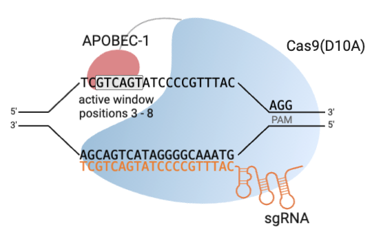
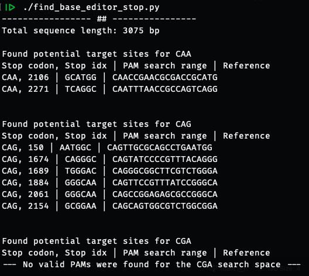

# CRISPRbasedit
We used *find_base_editor_stop.py* to identify loci within specified genes that are amenable to base editing so that a **CAG, CAA, or CGA** codon can be deaminated to form a premature stop codon.

For our publication, we used the canonical SpCas9 (NGG PAM) with an APOBEC1 C-to-T deaminase, which uses the XTEN linker (available on [Addgene](https://www.addgene.org/113349/)). In *E. coli*, this creates an active window for the deaminase around 3 - 8 bp from the 5' end of a 20 nt guide sequence (see diagram below). These conditions are very specific to these base editor components and organism, and the script will need to be modified to accommodate different PAMs, a different active window range, or different guide lengths. The base script assumptions are:
 - 3' NGG PAM
 - 20 nt guide
 - active window 3 - 8 bp from 5' end of guide
 - checks for CAA, CAG, and CGA codons

 ## Usage:
 1. Open up *find_base_editor_stop.py* in your text editor of choice, and find the searchSeq variable. Paste in the **full** nucleotide gene sequence of interest here. It's important that it's the full sequence since we have to check for in-frame codons. (Make sure it's the 5' -> 3' direction)
 2. Run
 `python find_base_editor_stop.py` via command line.
 3. Results will resemble the following:

 

 **Stop codon:** potential stop codon of interest  
 **Stop idx:** Nucleotide index position of this codon in the gene  
 **PAM search range:** The PAM space used to predict this codon (can contain multiple PAMs)  
 **Reference:** This sequence forms the basis for CBE guide design for this target. The codon of interest is on the 5' end, and PAM is on/close to the 3' end. 
